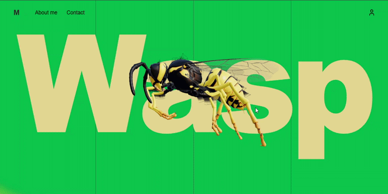

# 🐝 WASP
<p align="center">
  
</p>
<h3 align="center">
A modern 3D landing page built with smooth scrolling, immersive animations, and premium UI.
</h3>

<p align="center">
  
  
  
  
</p>

---

## ✨ Overview

**WASP** is a cinematic 3D landing page featuring an interactive Wasp model, buttery smooth scrolling, and premium motion design. It combines modern frontend technologies to deliver a fast, immersive, and visually engaging web experience.

---

## 🚀 Features

* 🐝 Interactive 3D Wasp Model
* 🎬 Smooth scrolling powered by GSAP
* ✨ Premium scroll-triggered animations
* ⚡ High-performance rendering
* 🎨 Modern UI & Typography
* 🌙 Clean component architecture
* 🚀 Optimized for deployment

---

# 📸 Screenshots

## Hero Section

<p align="center">

</p>

---

## 3D Model

<p align="center">

</p>

---

## Scroll Animations

<p align="center">

</p>

---

# 🛠 Tech Stack

| Technology     | Purpose                                         |
| -------------- | ----------------------------------------------- |
| React          | UI Library                                      |
| Three.js       | 3D Rendering                                    |
| GSAP           | Animations                                      |
| ScrollTrigger  | Scroll Animations                               |
| Tailwind CSS   | Styling                                         |
| Vite / Next.js | Build Tool *(Update according to your project)* |

---

# 📂 Project Structure

```text
src/
│
├── components/
├── assets/
├── models/
├── hooks/
├── utils/
├── pages/
└── App.jsx
```

---

# ⚙️ Installation

```bash
# Clone Repository
git clone https://github.com/yourusername/wasp.git

# Navigate
cd wasp

# Install
npm install

# Run
npm run dev
```

---

# 🎯 Performance

* Optimized animations
* GPU accelerated transforms
* Lazy-loaded assets
* Responsive rendering
* Smooth 60 FPS interactions

---

# 💡 Inspiration

Inspired by modern product landing pages that combine cinematic storytelling with immersive 3D experiences.

---

# ⭐ If you like this project

Give it a ⭐ on GitHub!

---

<p align="center">
Made with ❤️ by <b>Fayd Arshan</b>
</p>
